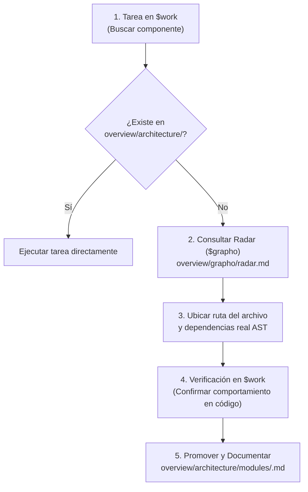
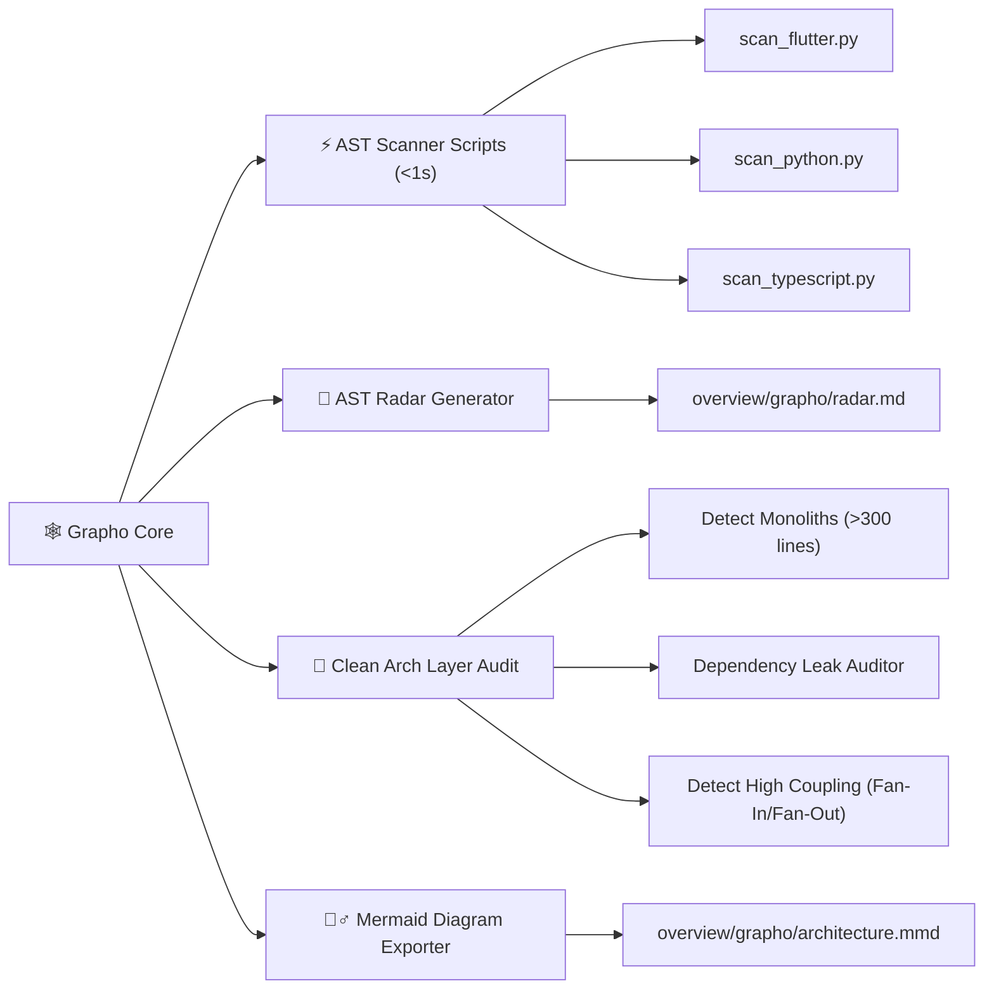

# 🕸️ Grapho Engine Skill Matrix & Directives

> **Skill Transversal de Análisis Determinista de Código, Radar AST y Grafos de Arquitectura**  
> Proporciona scripts ultrarrápidos para extraer el árbol de dependencias, validar Clean Architecture, ubicar archivos no documentados y exportar datos para diagramas Mermaid y visualizadores 3D.

---

## 🎯 Jerarquía y Posicionamiento en el Ecosistema

`grapho-agent-skill` opera como el **Radar y Motor de Verdad Determinista (Telemetría de Prioridad 2)** del proyecto:

1. **Prioridad 1 (Verdad Absoluta / Primera Línea)**: La tarea activa en `$work` y el código fuente vivo.
2. **Prioridad 2 (Telemetría AST / Radar)**: La radiografía estática generada por `$grapho` en `overview/grapho/radar.md`.
3. **Consolidación Oficial ($archi)**: La documentación oficial mantenida en `overview/architecture/`.

---

## 🔄 Flujo de Trabajo: Radar ➔ Verificación ➔ Promoción



---

## 🎯 Capacidades de la Habilidad



---

## 📋 Protocolo de Ejecución

Al ejecutar `$grapho` (o `$grapho:radar`), el agente ejecuta la auto-detección del stack y genera los artefactos en `overview/grapho/`:

```bash
# Invocación automática por el agente:
python3 .skill/grapho-agent-skill/scripts/scan_auto.py .
```

### Artefactos Generados:
- **`overview/grapho/radar.md`**: Índice sintético ultraligero (<100L) para búsqueda rápida de componentes y rutas relativas.
- **`overview/grapho/grapho_data.json`**: Estructura JSON completa del grafo AST con métricas de acoplamiento.
- **`overview/grapho/architecture.mmd`**: Diagrama Mermaid sintético por capas.
- **`overview/work/skill/grapho.md`**: Reporte de auditoría y violaciones detectadas (vía `$grapho:audit`).

---

## ⚡ Formato del Reporte de Auditoría (`overview/work/skill/grapho.md`)

```markdown
# 📋 Registro Activo de Tareas — Grapho Architecture

> **Generado por**: `grapho-agent-skill` (`$grapho:audit`)  
> **Última actualización**: YYYY-MM-DD  
> **Prioridad**: Telemetría Derivada (Prioridad 2)

## 🎯 Tareas Pendientes Accionables

| ID | Tipo | Estado | Resumen | Evidencia/Ruta | Acción Requerida |
|---|---|---|---|---|---|
| GRA-01 | Refactor | Pendiente | Archivo monolítico (>300 líneas) | `lib/features/home/home_page.dart` (420 líneas) | Modularizar en widgets |
| GRA-02 | Violation | Pendiente | Import prohibido: domain importa data | `lib/domain/usecases/login.dart` | Remover import de `data/` |
```
