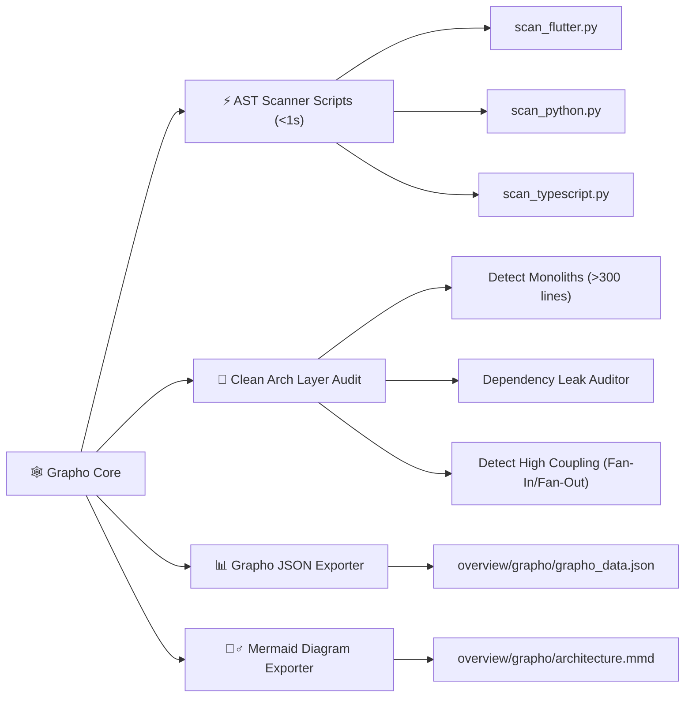

# 🕸️ Grapho Engine Skill Matrix & Directives

> **Skill Transversal de Análisis Determinista de Código y Grafos de Arquitectura**  
> Proporciona scripts ultrarrápidos para extraer el árbol de dependencias, validar Clean Architecture y exportar datos para diagramas Mermaid y visualizadores 3D.

---

## 🎯 Capacidades de la Habilidad



---

## 📋 Protocolo de Auditoría `$grapho:audit`

Al ejecutar `$grapho:audit`, el agente ejecuta el script correspondiente al stack del proyecto y registra el diagnóstico en `overview/work/skill/grapho.md`:

```bash
# Ejemplo de invocación automática por el agente:
python3 .skill/grapho-agent-skill/scripts/scan_flutter.py .
python3 .skill/grapho-agent-skill/scripts/export_mermaid.py overview/grapho/grapho_data.json
```

---

## ⚡ Formato del Reporte de Auditoría (`overview/work/skill/grapho.md`)

```markdown
# 📋 Registro Activo de Tareas — Grapho Architecture

> **Generado por**: `grapho-agent-skill` (`$grapho:audit`)  
> **Última actualización**: YYYY-MM-DD  

## 🎯 Tareas Pendientes Accionables

| ID | Tipo | Estado | Resumen | Evidencia/Ruta | Acción Requerida |
|---|---|---|---|---|---|
| GRA-01 | Refactor | Pendiente | Archivo monolítico (>300 líneas) | `lib/features/home/home_page.dart` (420 líneas) | Modularizar en widgets |
| GRA-02 | Violation | Pendiente | Import prohibido: domain importa data | `lib/domain/usecases/login.dart` | Remover import de `data/` |
```
