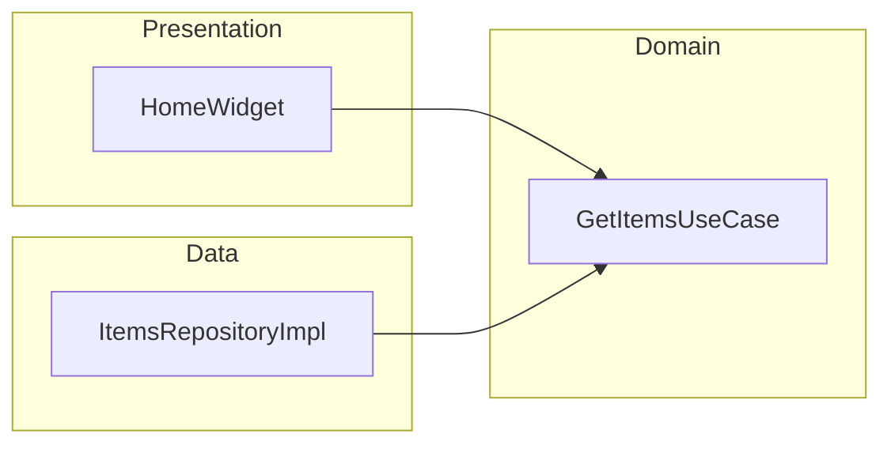

# 🧜‍♂️ Mermaid Graph Generation Standards

Los diagramas exportados deben utilizar `graph LR` o `graph TD` agrupando nodos en `subgraph` correspondientes a las capas o módulos principales:

```mermaid
graph LR
    subgraph Presentation
        UI_Home["HomeWidget"]
    end
    subgraph Domain
        UC_GetItems["GetItemsUseCase"]
    end
    subgraph Data
        Repo_Items["ItemsRepositoryImpl"]
    end

    UI_Home --> UC_GetItems
    Repo_Items --> UC_GetItems
```
